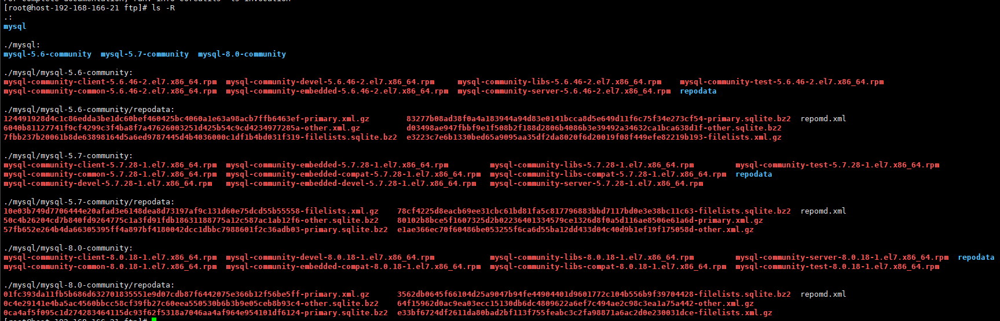

# Ansible Role: MySQL

Installs and configures MySQL or MariaDB server on RHEL/CentOS servers.

> 一些常见的安装请参考,这个roles在下面roles上进行更改的
>
> https://galaxy.ansible.com/geerlingguy/mysql

现在主要来说一下安装mysql的主从

支持的版本

* mysql5.6.*
* mysql5.7.*
* mysql8.0.*

安装mysql首先需要添加yum源，我个人建议建立自己私有的mysql yum源。下面是playbook的示例

```shell
# cat mysql_replication.yml 
---
### Mysql Master ###
- hosts: 192.168.166.115
  become: yes

  vars_files:
    - vars/mysql_replication.yml
  vars:
    #Replication settings
    mysql_replication_role: 'master'
    mysql_replication_user: {"name":"slave", "host":"192.168.166.140", "password":"10qweR@Kkk$"}
    mysql_server_id: "1"
    mysql_max_binlog_size: "100M"
    mysql_binlog_format: "ROW"
    mysql_replication_master: '192.168.166.115'


  pre_tasks:
  - name: Create the MySQL repo.
    include: tasks/mysql_repo.yml

  roles:
  - role: clay_wangzhi.mysql
    #vars:
    #  mysql_root_password_update: false

### Mysql Slave ###
- hosts: 192.168.166.140
  become: yes

  vars_files:
    - vars/mysql_replication.yml

  vars:
    #Replication settings
    mysql_replication_role: 'slave'
    mysql_server_id: "2"
    mysql_replication_master: '192.168.166.115'
    mysql_replication_user: {"name":"slave", "password":"10qweR@Kkk$"}


  pre_tasks:
  - name: Create the MySQL repo.
    include: tasks/mysql_repo.yml

  roles:
  - role: clay_wangzhi.mysql
```

里面加入了几个文件，分别放在当前目录下的`tasks/mysql_repo.yml`、`vars/mysql_replication.yml`

`vars/mysql_replication.yml`的文件内容为

```shell
# cat vars/mysql_replication.yml 
#When host memory is 8G, Memory settings
mysql_thread_cache_size: "64"
mysql_query_cache_size: "128M"
mysql_innodb_buffer_pool_size: "2048M"
mysql_tmp_table_size: "64M"
mysql_table_open_cache: "1024"

#Update the root password
mysql_root_password_update: true
mysql_root_password: settle#suncar2020J

# Set authentication_plugin in 8.0
#authentication_plugin: "sha256_password"

```


`tasks/mysql_repo.yml`的文件内容为

```shell
# cat tasks/mysql_repo.yml
---
#- name: Install the MySQL repo.
#  yum:
#    name: https://repo.mysql.com/mysql80-community-release-el7-3.noarch.rpm
#    state: present
#  when: ansible_os_family == "RedHat"

- name: Create the MySQL repo.
  copy:
    src: files/mysql-community.repo
    dest: /etc/yum.repos.d/
    mode: 0644

#- name: Disalbe the Mysql repo of "5.6".
#  command: yum-config-manager --disable mysql56-community

#- name: Enable the Mysql repo of "5.7".
#  command: yum-config-manager --enable mysql57-community

#- name: Enable the Mysql repo of "8.0".
#  command: yum-config-manager --enable mysql80-community

- name: Create mysql log directory
  file:
    path: /var/log/mysql
    state: directory
    mode: 0755

- name: Override variables for MySQL (RedHat).
  set_fact:
    mysql_daemon: mysqld
    mysql_packages: ['mysql-community-server']
    mysql_slow_query_log_file: /var/log/mysql/mysql-slow.log
    mysql_log_error: /var/log/mysql/mysqld.err
    mysql_syslog_tag: mysqld
    mysql_pid_file: /var/run/mysqld/mysqld.pid
    mysql_socket: /var/lib/mysql/mysql.sock
  when: ansible_os_family == "RedHat"
```

文件内容中包含`files/mysql-community.repo`这个文件，文件位置也是相对于playbook所在位置来讲,文件内容是我建立的私有yum源，文件内容如下：

```
# cat files/mysql-community.repo 
[mysql56-community]
name=MySQL 5.6 Community Server
baseurl=ftp://192.168.166.21/mysql/mysql-5.6-community
enabled=1
gpgcheck=0

# Enable to use MySQL 5.7
[mysql57-community]
name=MySQL 5.7 Community Server
baseurl=ftp://192.168.166.21/mysql/mysql-5.7-community
enabled=0
gpgcheck=0

# Enable to use MySQL 8.0
[mysql80-community]
name=MySQL 8.0 Community Server
baseurl=ftp://192.168.166.21/mysql/mysql-8.0-community
enabled=0
gpgcheck=0
```

## yum源的制作

选择一台主机安装vsftpd和createrepo

```shell
yum -y install createrepo vsftpd
```

启动vsftpd服务

```
systemctl start vsftpd
```

从官网下载每个版本的最新稳定版  的rpm压缩包 到本地，然后上传到服务器上，用`unzip`解压，然后将rpm分别放入vsftpd建好的目录下，然后进入到每个版本的目录下，进行创建repodata文件

```
creatrepo ./
```

最后目录结构如下



## License

MIT / BSD

## Author Information

This role was created in 2014 by [Jeff Geerling](https://www.jeffgeerling.com/), author of [Ansible for DevOps](https://www.ansiblefordevops.com/).

Updated by clay in 2019.